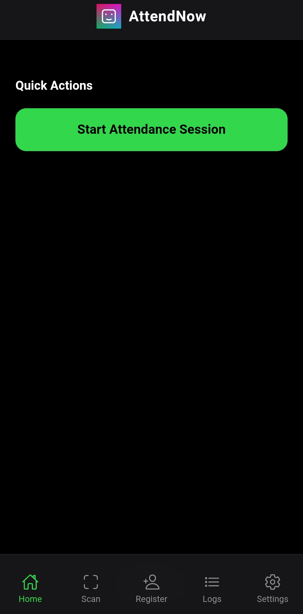
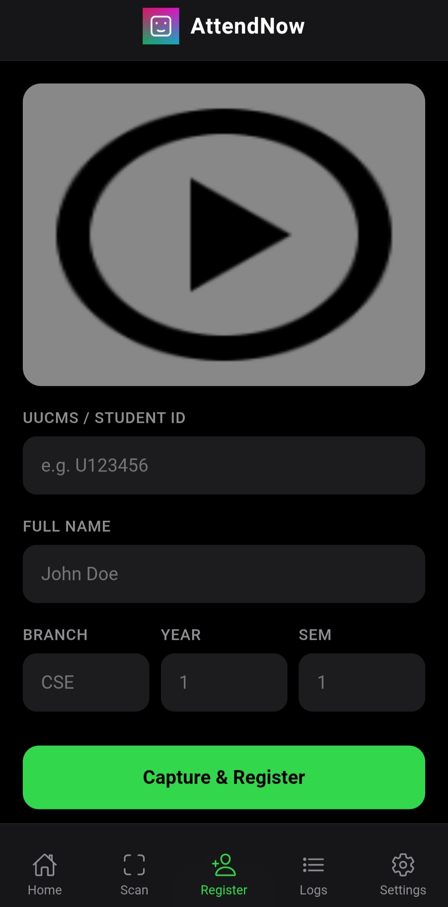
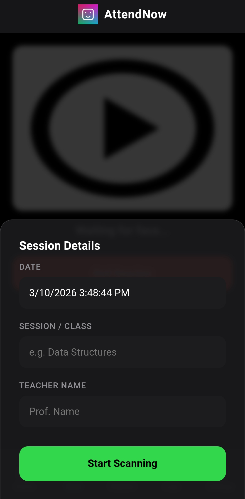
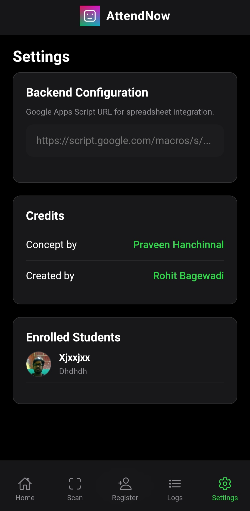
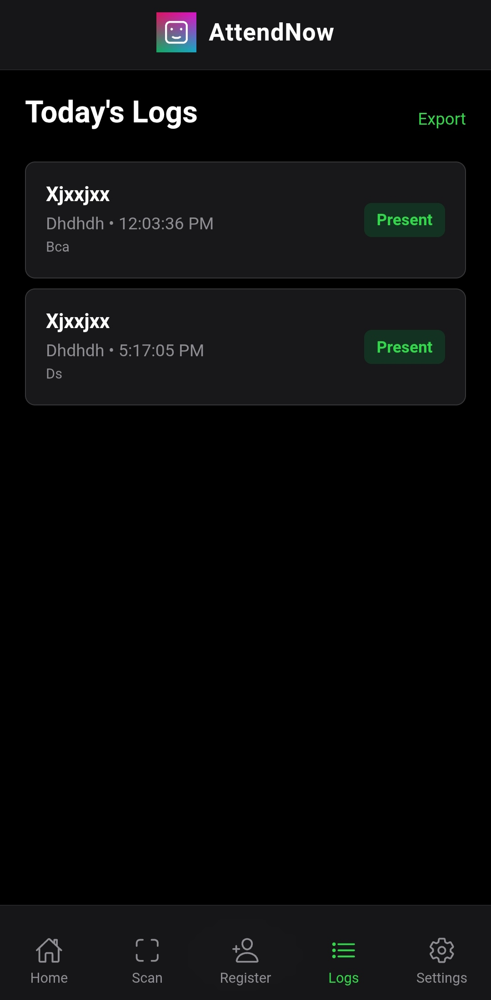

# AttendNow Mobile Application

## Project Overview
AttendNow is an advanced, privacy-centric mobile application designed for attendance management using on-device facial recognition. By leveraging deep learning models locally, the system ensures rapid verification, high reliability in offline environments, and the strict protection of biometric data.

The application integrates seamlessly with cloud environments for logging and administrative reporting through a serverless architecture.

## Interface Showcase
The following screen captures demonstrate the core workflow from initial dashboard to final data synchronization:

<div align="center">
  <table>
    <tr>
      <td align="center"><b>Splash Screen</b><br></td>
      <td align="center"><b>Main Dashboard</b><br></td>
      <td align="center"><b>Student Registration</b><br></td>
    </tr>
    <tr>
      <td align="center"><b>Session Setup</b><br></td>
      <td align="center"><b>Attendance Logs</b><br></td>
      <td align="center"><b>Settings & Credits</b><br></td>
    </tr>
  </table>
</div>

## Technical Architecture
AttendNow is built using a modern, efficient tech stack designed for high performance and privacy:
- **Core Engine**: face-api.js (TensorFlow.js based) for local neural network processing.
- **Framework**: Capacitor for cross-platform Android deployment.
- **Frontend**: Standard HTML5, CSS3, and JavaScript (Vanilla) for a lightweight, fast-loading interface.
- **Backend Integration**: Automated synchronization with Google Sheets API via Google Apps Script.

## Key Features
- **Local Face Verification**: Biometric data is processed and stored on-device, never leaving the local environment.
- **Offline Resilience**: Full functional capability without an internet connection; data caches locally and synchronizes upon reconnection.
- **Direct CSV Export**: Native capability to export attendance records to CSV format for external processing.
- **Synchronized Backend**: Direct integration with Google Sheets for real-time attendance dashboards.

## Getting Started

### Installation
1.  **Repository Setup**:
    Clone the repository to your local machine:
    ```bash
    git clone [repository-url]
    cd mobile-app
    ```
2.  **Dependency Installation**:
    Ensure Node.js is installed, then run:
    ```bash
    npm install
    ```
3.  **Android Deployment**:
    Synchronize the web assets with the Android project:
    ```bash
    npx cap sync
    ```
4.  **Launch**:
    Open the project in Android Studio to build the APK:
    ```bash
    npx cap open android
    ```

## Usage Instructions
1.  **Registration**: Navigate to the "Register Student" interface. Capture unique facial descriptors to store them in the local database.
2.  **Verification**: Initiate an attendance session. The system will scan and match faces against the local database in real-time.
3.  **Reporting**: Export current attendance logs as CSV or synchronize with the configured Google Spreadsheet.

## Backend Configuration
To activate cloud synchronization:
1.  Deploy the included `APPS_SCRIPT_CODE.gs` as a Google Apps Script Web App.
2.  Assign the resulting Web App URL in the application settings.

## Credits and Contributors
- **Concept and Strategy**: Praveen Hanchinnal
- **Lead Implementation**: Rohit Bagewadi

## License
This project is proprietary and confidential. Unauthorized copying, modification, or distribution is strictly prohibited.
